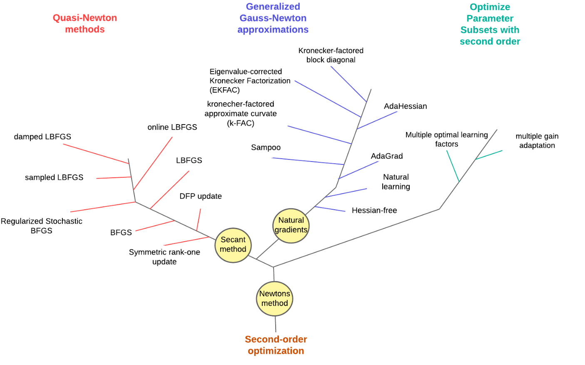
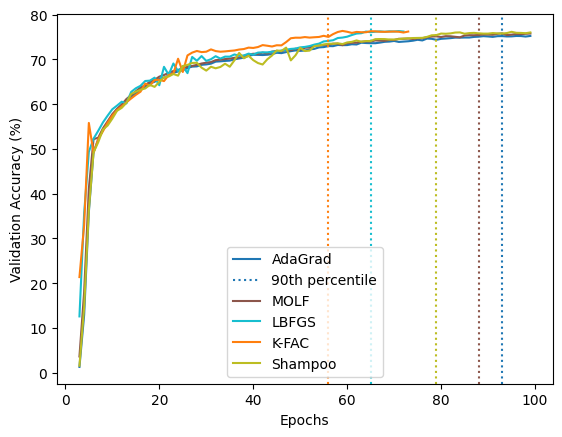

# Second Order Neural Network Optimization: Meta Analysis



Second-order optimization methods for neural networks utilize curvature information to improve
training dynamics by incorporating second-order derivatives or their approximations. These meth-
ods can be classified into three main categories based on their approach: Quasi-Newton methods,
Generalized Gauss-Newton methods, and Parameter Subset Optimization methods. Each category
represents distinct strategies to balance computational efficiency with the advantages of second-order
information.

We compare the performance of the following second-order optimization algorithms.

* K-FAC: Implementation from "Scalable K-FAC Training for Deep Neural Networks with Distributed Preconditioning", repo: https://github.com/lzhangbv/kfac_pytorch
* L-BFGS: Implementation from "Implementation of Stochastic Quasi-Newton’s Method in PyTorch", repo: https://github.com/harryliew/SdLBFGS
* Shampoo: Implementation from "Scalable Second Order Optimization for Deep Learning", repo: \url{https://github.com/google-research/google-research/tree/master/scalable_shampoo/pytorch}
* \item \textbf{MOLF:} Implementation from "Multiple optimal learning factors for the multi-layer perceptron".

|     | Validation Accuracy (%) | Training Steps per Second  | 90th Percentile Epoch |
| -------- | ------- | -------- | ------- |
| Shampoo  | 75.93    | 1.24     | 79    |
| K-FAC  | 76.39    | 1.02     | 56    |
| L-BFGS  | 76.23    | 0.92     | 65    |
| AdaGrad  | 75.63    | 1.26     | 93    |
| MOLF  | 75.83    | 1.13     | 88    |



## Run experiments

```
$ mkdir logs
$ bash batch.sh
```

See `python examples/pytorch_{dataset}_{model}.py --help` for a full list of hyper-parameters.

Make sure the datasets were prepared in correct  dirs (e.g., /datasets/cifar10) before running the experiments. We downloaded Cifar-100 dataset via Torchvision's [Datasets](https://pytorch.org/vision/stable/datasets.html)